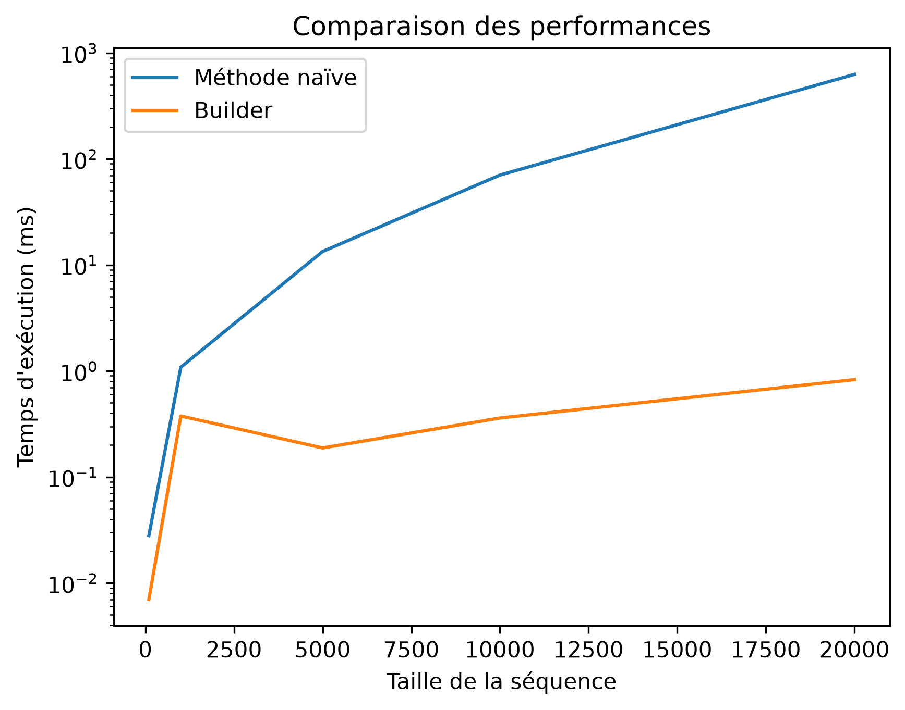
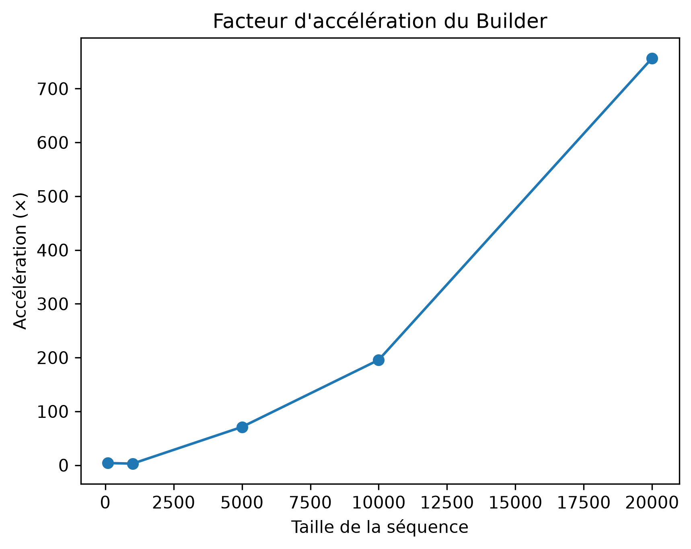

# Immutable Sequence Complexity Lab

## Problem

Two methods can produce the same textual result but have very different computational costs depending on how they are implemented.

This project compares:
- a naive string-concatenation approach;
- a `StringBuilder`-based approach.

The goal is to observe how implementation choices can change the time complexity from approximately `O(n²)` to `O(n)`.
## Concept

This project explores two main concepts:

- immutable linked lists;
- algorithmic complexity and performance analysis.

It shows how the same logical result can have very different computational costs depending on the implementation.

## How it works

Each node stores:

- a `Value`;
- a `Tail`, which references the rest of the list.

`Push(value)` creates a new node whose `Tail` points to the existing list.

The original list is not modified.

Example:

10 -> 20 -> 30

After:

Push(5)

The new list becomes:

5 -> 10 -> 20 -> 30

while the original list remains:

10 -> 20 -> 30

## Architecture

The project contains two main parts:

- `DataStructures/ImmutableLinkedList.cs`
  - implements the immutable linked list;
  - contains `Push`, `Count`, `Contains`, `Reverse`, `ToNaiveString`, and `ToBuilderString`.

- `Program.cs`
  - creates sample lists;
  - runs functional checks;
  - runs the performance benchmark.

  ## Algorithms

### Push

Adds a new value at the front of the list by creating a new node whose `Tail` references the existing list.

Example:

10 -> 20 -> 30

Push(5)

5 -> 10 -> 20 -> 30

### Count

Traverses the list node by node and counts how many elements it contains.

### Contains

Traverses the list until:
- the requested value is found, in which case it returns `true`;
- or the end of the list is reached, in which case it returns `false`.

### Reverse

Starts from an empty list and traverses the original list.

Each visited value is pushed onto the front of the new list.

Example:

10 -> 20 -> 30

becomes:

30 -> 20 -> 10

### ToNaiveString

Traverses the list and repeatedly concatenates each value to a string.

### ToBuilderString

Traverses the list and appends each value to a `StringBuilder`, avoiding repeated reconstruction of increasingly large strings.

## Complexity

| Operation | Time Complexity | Extra Space | Explanation |
|---|---:|---:|---|
| `Push` | `O(1)` | `O(1)` | Creates one new node and references the existing list. |
| `IsEmpty` | `O(1)` | `O(1)` | Checks whether `Tail` is `null`. |
| `Count` | `O(n)` | `O(1)` | Traverses every node once. |
| `Contains` | `O(n)` worst case | `O(1)` | May need to inspect every node. |
| `Reverse` | `O(n)` | `O(n)` | Traverses all nodes and creates a new node for each one. |
| `ToNaiveString` | approximately `O(n²)` | approximately `O(n²)` | Repeated string concatenation can copy increasingly large strings. |
| `ToBuilderString` | approximately `O(n)` | `O(n)` | Uses `StringBuilder` to accumulate text efficiently. |

## Benchmarks

The benchmark compares repeated string concatenation with a `StringBuilder` implementation.

Measurements were performed in .NET Release mode with a warm-up phase and 10 repetitions per input size.

| List size | Naive average | StringBuilder average | Naive / Builder |
|---:|---:|---:|---:|
| 100    | 0.028 ms   | 0.007 ms | 4.0x   |
| 1,000  | 1.085 ms   | 0.376 ms | 2.9x   |
| 5,000  | 13.392 ms  | 0.188 ms | 71.1x  |
| 10,000 | 70.399 ms  | 0.360 ms | 195.7x |
| 20,000 | 627.252 ms | 0.829 ms | 756.6x |
### Performance comparison

### Speedup factor

### Interpretation

Both implementations produce the same textual result, but their performance diverges as the list grows.

The naive implementation repeatedly concatenates immutable strings. As the accumulated string becomes larger, increasingly large amounts of text may need to be copied.

The `StringBuilder` implementation accumulates the output more efficiently and scales much better in this experiment.

At 20,000 elements, the naive implementation took approximately 756.6 times as long as the `StringBuilder` implementation in this benchmark run.

These ratios should not be interpreted as universal constants. Actual execution times depend on the runtime environment, hardware, JIT compilation, garbage collection, and other system effects.

## Tests

The project includes automated unit tests using xUnit.

The test suite verifies:

- `Push` adds a value at the front of the list;
- `Push` preserves the original list;
- structural sharing is preserved;
- `Count` returns the correct number of elements;
- `Contains` returns `true` when a value exists;
- `Contains` returns `false` when a value does not exist;
- `Reverse` correctly reverses the list;
- `ToNaiveString` and `ToBuilderString` produce the same textual result.

Current test result:

- 7 tests executed
- 7 passed
- 0 failed

Performance measurements are handled separately by the benchmark.

## What I learned

This project helped me understand that algorithmic complexity is not only a theoretical concept.

I learned that:

- two implementations can produce the same correct result while having very different performance characteristics;
- immutable linked lists can reuse existing nodes through structural sharing;
- `Push` can run in `O(1)` time because it creates only one new node;
- operations such as `Count`, `Contains`, and `Reverse` require traversing the list and therefore depend on its size;
- repeated string concatenation can accidentally create quadratic behavior;
- `StringBuilder` avoids repeatedly rebuilding increasingly large strings;
- benchmarks should be interpreted as measurements of a specific environment, not universal constants;
- correctness tests and performance benchmarks answer different questions;
- automated tests help verify that optimizations do not change the expected behavior.

## References

- Eric Lippert, *Fabulous Adventures in Data Structures and Algorithms*, MEAP Edition Version 6, Chapter 1.
- Microsoft .NET documentation — `StringBuilder`.
- Microsoft .NET documentation — `Stopwatch`.
- xUnit documentation.

